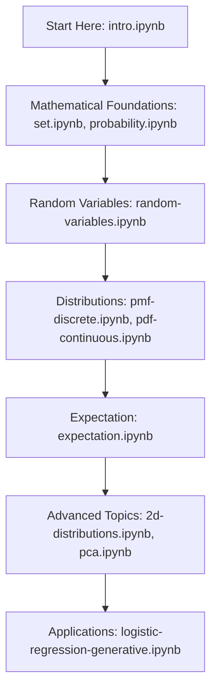

# Probability, Statistics & Data Visualization Teaching Resources

[](https://nipunbatra.github.io/psdv-teaching/)
[](https://nipunbatra.github.io/psdv25/)
[](LICENSE)
[](https://quarto.org/)

> **A comprehensive collection of interactive Jupyter notebooks, visualizations, and educational resources for teaching probability, statistics, and data visualization.**

Developed by [Prof. Nipun Batra](https://nipunbatra.github.io) at Indian Institute of Technology, Gandhinagar for the ES 114 course.

## Features

- **24 Interactive Notebooks**: Covering probability theory, statistics, and data visualization
- **Beautiful Visualizations**: High-quality plots and interactive demonstrations
- **Mathematical Rigor**: From basic concepts to advanced topics like PCA and joint distributions
- **Practical Applications**: Real-world datasets including MNIST, height-weight data, and more
- **Self-Contained Learning**: Each notebook includes learning objectives, theory, and practical implementations

## Content Overview

### Core Topics Covered

| Topic Category | Notebooks | Key Concepts |
|---|---|---|
| **Foundations** | `intro.ipynb`, `set.ipynb`, `probability.ipynb` | Probability theory, set operations, random number generation |
| **Random Variables** | `random-variables.ipynb`, `pmf-discrete.ipynb`, `pdf-continuous.ipynb` | Discrete and continuous distributions, PMF, PDF |
| **Expectation & Variance** | `expectation.ipynb`, `iid.ipynb` | Expected values, variance, independence |
| **Advanced Distributions** | `2d-distributions.ipynb`, `joint-distribution-properties.ipynb` | Multivariate distributions, covariance, correlation |
| **Statistical Concepts** | `law-large-numbers.ipynb`, `cdf.ipynb`, `cdf-discrete.ipynb` | LLN, CLT, cumulative distribution functions |
| **Machine Learning** | `pca.ipynb`, `logistic-regression-generative.ipynb`, `embeddings-angle.ipynb` | Dimensionality reduction, classification, word embeddings |
| **Data Science Tools** | `intro-numpy.ipynb`, `introduction-pandas.ipynb`, `introduction-matplotlib.ipynb` | NumPy, Pandas, Matplotlib fundamentals |
| **Interactive Learning** | `widgets.ipynb`, `quiz1.ipynb` | Interactive visualizations, self-assessment |

### Learning Path



## Quick Start

### Prerequisites
- Python 3.8+
- Jupyter Notebook or JupyterLab
- Required packages: `numpy`, `matplotlib`, `torch`, `pandas`, `sklearn`

### Installation

```bash
# Clone the repository
git clone https://github.com/nipunbatra/psdv-teaching.git
cd psdv-teaching

# Install dependencies
pip install -r requirements.txt

# Launch Jupyter
jupyter lab notebooks/
```

### Browse Online
Visit [https://nipunbatra.github.io/psdv-teaching/](https://nipunbatra.github.io/psdv-teaching/) to explore all notebooks in your browser.

## Course Information

This repository supports the **ES 114: Probability, Statistics and Data Visualization** course at IIT Gandhinagar.

- **Current Course Website**: [https://nipunbatra.github.io/psdv25/](https://nipunbatra.github.io/psdv25/)
- **Instructor**: [Prof. Nipun Batra](https://nipunbatra.github.io)
- **Level**: Undergraduate (No prerequisites)
- **Tools**: Python, Jupyter, PyTorch, NumPy, Matplotlib, Pandas

## Interactive Demos

The repository includes several interactive applications in the `/apps` directory:

- **Distribution Visualizer**: Interactive plotting of probability distributions
- **Central Limit Theorem Demo**: Live demonstration of LLN and CLT
- **COVID Testing Simulation**: Bayesian probability in action
- **Neural Network Digits**: MNIST classification demo

## Repository Statistics

- **24 Jupyter Notebooks** with comprehensive educational content
- **500+ Python code cells** with detailed explanations
- **100+ Mathematical equations** with proper LaTeX formatting
- **50+ High-quality visualizations** and interactive plots
- **Comprehensive coverage** from basic probability to advanced ML topics

## Technical Details

- **Built with**: [Quarto](https://quarto.org/) for beautiful website generation
- **Notebook Format**: Jupyter notebooks with rich metadata
- **Visualization**: Matplotlib, PyTorch, interactive widgets
- **Mathematical Notation**: LaTeX rendering throughout
- **Responsive Design**: Works on desktop, tablet, and mobile

## Contributing

We welcome contributions from the community! Please see our [Contributing Guidelines](CONTRIBUTING.md) for details.

### How to Contribute
1. **Report Issues**: Found a bug or have a suggestion? [Open an issue](https://github.com/nipunbatra/psdv-teaching/issues)
2. **Improve Content**: Submit pull requests for notebook improvements
3. **Add Examples**: Contribute new examples or applications
4. **Documentation**: Help improve documentation and explanations

## Contact

- **Instructor**: Prof. Nipun Batra ([nipun.batra@iitgn.ac.in](mailto:nipun.batra@iitgn.ac.in))
- **Website**: [https://nipunbatra.github.io](https://nipunbatra.github.io)
- **Course Issues**: Use GitHub Issues for technical problems

## License

This project is licensed under the MIT License - see the [LICENSE](LICENSE) file for details.

## Acknowledgments

- **Teaching Assistants**: Excellent TAs who have contributed to course development over the years
- **Students**: Feedback and suggestions from multiple course iterations
- **Open Source Community**: Built using amazing open-source tools like Jupyter, Quarto, and PyTorch

## Related Resources

- **Course Website 2025**: [https://nipunbatra.github.io/psdv25/](https://nipunbatra.github.io/psdv25/)
- **IIT Gandhinagar**: [https://iitgn.ac.in](https://iitgn.ac.in)
- **Jupyter**: [https://jupyter.org](https://jupyter.org)
- **Quarto**: [https://quarto.org](https://quarto.org)

---

<p align="center">
  <strong>Made with care for students learning probability, statistics, and data visualization</strong>
</p>